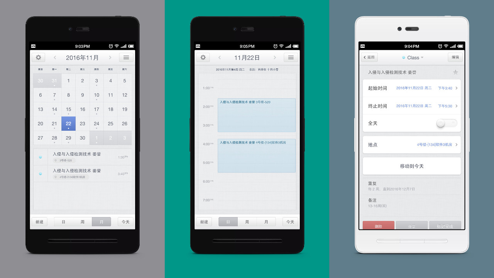

### 声明
我也毕业了，不能再登录学校的选课系统，故不再维护。

### 简介
如何将课程表导入日历？

几年前科协 VC 组的沈学长给出了一个优雅的办法：把课程表导出为 iCalendar 文件。[iCalendar][1] 是“日历数据交换”的标准。绝大多数邮箱服务商，如 Outlook、Gmail 等，都提供日历同步服务，并且支持该标准。而绝大多数的移动设备平台，如 Android、iOS、Windows Phone 等，都**原生**支持该同步功能。只要用你的邮箱帐号登录这些设备，就能将日历事件同步到系统日历之中。

因为学长已经毕业，而且选课系统也进行了更换，学长原来做的软件[“黑龙江大学课表日程助手”][2]已经不能用了。为了继承学长的火之意志，我开发了这个项目。

### 使用方法
1. 从课程表导出 ics 文件
    + 方法一：
    使用 Firefox、Chrome 等现代浏览器打开选课网站，登录之后按`F12`打开开发人员工具，将脚本代码全部拷贝进控制台，然后按回车，选课页面便会弹出下载文件窗口，保存即可。
    + 方法二：
    Firefox 安装脚本管理器扩展 Greasemonkey（Chrome 则安装 Tampermonkey），安装后再安装此脚本。安装后每次登录选课网站便会弹出下载文件窗口，保存即可。
2. 将 ics 文件导入你的日历
    + [将活动导入到 Google 日历][3]
    + [在 Web 上使用 Outlook 中的日历][4]
    + [iCloud 需要在 Mac 上使用 Calendar 才支持导入][5]
3. 在你的移动设备上登录你的邮箱帐号
    + [Android 添加或移除帐号][6]
    + [在 iPhone、iPad 或 iPod touch 上设置电子邮件帐户][7]
    + [在 Windows Phone 上设置电子邮件][8]
4. 登录成功后日历就会自动同步

### 效果图

[1]:https://zh.wikipedia.org/wiki/ICalendar
[2]:https://github.com/chrisniael/whatclass.cn#%E9%BB%91%E9%BE%99%E6%B1%9F%E5%A4%A7%E5%AD%A6%E8%AF%BE%E8%A1%A8%E6%97%A5%E7%A8%8B%E5%8A%A9%E6%89%8B
[3]:https://support.google.com/calendar/answer/37118?hl=zh-Hans
[4]:https://support.office.com/zh-cn/article/%e5%9c%a8-Web-%e4%b8%8a%e4%bd%bf%e7%94%a8-Outlook-%e4%b8%ad%e7%9a%84%e6%97%a5%e5%8e%86-8cfd8a5e-de9a-4468-9225-8611c8c8c7b0?ui=zh-CN&rs=zh-CN&ad=CN
[5]:https://support.apple.com/kb/PH22713?viewlocale=zh_CN&locale=zh_CN
[6]:https://support.google.com/nexus/answer/2840815?hl=zh-Hans
[7]:https://support.apple.com/zh-cn/HT201320
[8]:https://support.office.com/zh-cn/article/%E5%9C%A8-Windows-Phone-%E4%B8%8A%E8%AE%BE%E7%BD%AE%E7%94%B5%E5%AD%90%E9%82%AE%E4%BB%B6-181a112a-be92-49ca-ade5-399264b3d417
